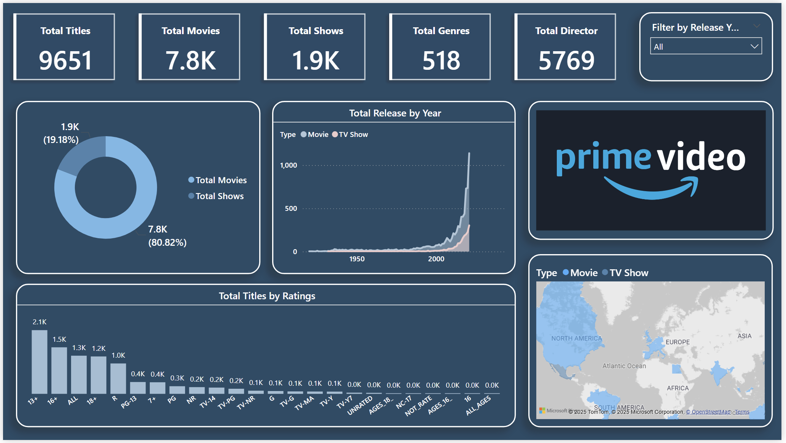

# 🎬 Amazon Prime Movies Dashboard (Power BI)

This Power BI report visualizes the Amazon Prime movie and show listings dataset. It helps analyze the content library by type, country, release year, genre, and more.

## 📊 Features
- Total number of Movies and TV Shows
- Distribution of content by country and year
- Ratings breakdown (G, PG, R, etc.)
- Top genres
- Timeline of content released

## 📂 Dataset Columns
- `show_id`
- `type`
- `title`
- `director`
- `cast`
- `country`
- `date_added`
- `release_year`
- `rating`
- `duration`
- `listed_in`
- `description`

## 📁 Files Included
- `AmazonPrimeMovies.pbix` – Main Power BI report
- `images/dashboard_preview.png` – Dashboard screenshot

## 🖼️ Report Preview

## 🛠️ Tools Used
- Power BI
- DAX
